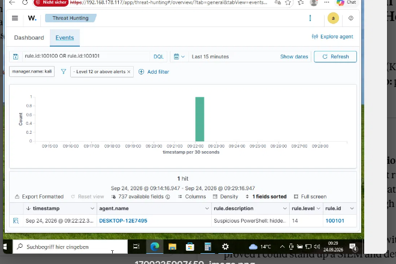

# Phishing Attack Detection with Wazuh + Sysmon — SOC Home Lab (Project 2)

**Author:** Rajiv
**Date:** September 2026
**Environment:** VirtualBox home lab (Kali/Wazuh manager + Windows 10 victim)
**Repo:** part of the `home-lab-siem-wazuh` portfolio

---

## 1. Objective

Build an end-to-end phishing **detection** lab from the defender's perspective — not just running an attack, but proving that a SIEM can catch the full chain from a suspicious email through to what happens when a user clicks it.

Project 1 (Wazuh + RDP brute-force with Hydra) proved I could stand up a SIEM and detect a noisy network attack. This project goes after something closer to the real day-one SOC task: **take a phishing email, triage it, simulate the click, and detect the execution on the endpoint through custom detection engineering.**

The detection chain the lab demonstrates:

```
Phishing email  →  malicious LNK attachment  →  user double-click
      →  hidden PowerShell (payload)  →  Sysmon (endpoint telemetry)
      →  Wazuh manager  →  custom rule  →  high-severity ALERT
```

Mapped to MITRE ATT&CK: **T1566.001 (Spearphishing Attachment) → T1204.002 (User Execution: Malicious File) → T1059.001 (PowerShell) → T1027 (Obfuscated/Hidden Execution).**

---

## 2. Lab Environment

| Component | Detail |
|-----------|--------|
| Hypervisor | VirtualBox 7.2.16 |
| SIEM manager | Kali Linux 2026.2 — Wazuh 4.14 all-in-one (indexer, manager, dashboard), 192.168.178.117 |
| Victim | Windows 10, Wazuh agent + Sysmon, 192.168.178.118 |
| Endpoint telemetry | Sysmon v15 with SwiftOnSecurity config (`sysmonconfig-export.xml`) |
| Networking | Bridged adapters, same home subnet |

Safety note: the entire lab runs on an isolated home subnet. Any "malicious" payload is deliberately **benign** — it writes a marker file and launches `calc.exe`. No real malware is used. The point is to generate the *telemetry pattern* a real attack produces, not to run something dangerous.

---

## 3. What I Built — Step by Step

### 3.1 Endpoint visibility with Sysmon

Sysmon provides the process-level telemetry that Windows' default logs don't — specifically **Event ID 1 (Process Create)**, which records the parent/child process relationship, full command line, hashes, and user context. This is the field data a SOC pivots on.

- Installed Sysmon on the Windows victim with the SwiftOnSecurity configuration.
- Verified it was logging live (Event IDs 1, 3, 11, 22 appearing in `Microsoft-Windows-Sysmon/Operational`).

### 3.2 Forwarding Sysmon to Wazuh

Sysmon logging locally is not enough — Wazuh has to **collect** the channel. Added a `localfile` block to the agent's `ossec.conf`:

```xml
<localfile>
  <location>Microsoft-Windows-Sysmon/Operational</location>
  <log_format>eventchannel</log_format>
</localfile>
```

Restarted the agent (`WazuhSvc`) and confirmed collection in the dashboard (Discover → `data.win.system.channel:"Microsoft-Windows-Sysmon/Operational"` returned live hits). This proved the pipeline: **endpoint → agent → manager → dashboard.**

### 3.3 Phishing email triage (analyst skill)

Analyzed real phishing email samples to practice header-based triage — the most common SOC L1 task:

- **Header analysis** — the `Received:` chain reveals the true sending path, which the `From:` field cannot be trusted to show.
- **Authentication** — SPF / DKIM / DMARC results.
- **Sender reputation** — lookalike domains, newly-registered domains (NRDs).
- **Verdict** with supporting evidence.

**Key lesson documented:** *Authentication ≠ trust.* A phisher who **owns** a lookalike domain (e.g. `microsoft-invoices.com`) can pass SPF/DKIM/DMARC legitimately, because they really do control that domain. Passing authentication only proves the mail is authentic **to its domain** — not that the domain is trustworthy. The verdict comes from domain identity and reputation (age, ownership, brand match), not auth results alone. This is what separates an analyst who waves auth-passing phish through from one who catches it.

### 3.4 Simulating the attack (LNK delivery)

Modern phishing shifted heavily to **LNK (shortcut) attachments** after Microsoft disabled Office macros by default in 2022, so the lab uses the current technique rather than legacy macros.

Built a shortcut named `Invoice_2024.pdf.lnk` — Windows hides the `.lnk` extension, so to the victim it looks like a PDF. On double-click it launches hidden PowerShell:

```
powershell.exe -NoProfile -WindowStyle Hidden -Command "<benign payload: write marker file + launch calc.exe>"
```

When clicked: `calc.exe` popped and the marker file was written — confirming execution. Sysmon recorded the telltale Event ID 1:

- **ParentImage:** `C:\Windows\explorer.exe` (a GUI double-click launched the shell)
- **Image:** `...powershell.exe`
- **CommandLine:** contains `-WindowStyle Hidden` and `-NoProfile`

That `explorer.exe → powershell.exe (hidden window)` chain is the phishing-execution signature.

#### Anatomy of the attack — what happens on double-click

The file looks like `Invoice_2024.pdf` but is really `Invoice_2024.pdf.lnk`, a Windows **shortcut**. Windows hides the `.lnk` extension and the shortcut carries a document icon, so the eye sees a PDF. A `.lnk` is not a document — it stores a **target to run** and **arguments to pass**. Here the target is `powershell.exe` and the arguments are the hidden payload.

On double-click:

1. **`explorer.exe` (the Windows shell) reads the shortcut and launches its target.** This is why the recorded parent process is Explorer — a GUI click spawned the shell. (In a real attack the parent would instead be Outlook, a browser, or an archive tool — whatever the victim opened the attachment from.)
2. **`powershell.exe` starts as a child process** with:
   - `-WindowStyle Hidden` → no window appears; the victim sees nothing and assumes "the PDF didn't open."
   - `-NoProfile` → clean, predictable execution; a common attacker flag.
   - It runs as the **normal user** (`IntegrityLevel: Medium`) — no admin, no UAC prompt.
3. **The payload executes.** In this lab: write a marker file, launch `calc.exe`. In a real attack the same slot would download a second stage, establish C2, steal credentials, or drop ransomware — identical delivery, only the `-Command` content differs.
4. **PowerShell exits** in a fraction of a second.

Every step is invisible to the user but loud to Sysmon, which fires Event ID 1 the moment PowerShell launches. **The file never "opens" anything — it *executes* something, using PowerShell as the engine and a hidden window to stay unseen. The defender catches it not by the file, but by the anomalous parent→child process behavior it produces.**

### 3.5 Custom detection rule (detection engineering)

Wazuh **collected** the click event but raised no alert — a plain `explorer → powershell` process-create matches no built-in rule, so it stays below the logging threshold and never surfaces as an alert. **Closing that gap is exactly what a custom rule is for.**

Final working rules (`/var/ossec/etc/rules/local_rules.xml`), chained to the Sysmon Event ID 1 base decoder (`61603`):

```xml
<group name="sysmon,phishing,attack,">

  <rule id="100100" level="12">
    <if_sid>61603</if_sid>
    <field name="win.eventdata.parentImage" type="pcre2">explorer\.exe</field>
    <field name="win.eventdata.image" type="pcre2">powershell\.exe</field>
    <description>Phishing execution: PowerShell spawned by Explorer (likely LNK/document click)</description>
    <mitre>
      <id>T1059.001</id>
      <id>T1204.002</id>
      <id>T1566.001</id>
    </mitre>
  </rule>

  <rule id="100101" level="14">
    <if_sid>61603</if_sid>
    <field name="win.eventdata.commandLine" type="pcre2">(?i)WindowStyle\s+Hidden</field>
    <description>Suspicious PowerShell: hidden window (phishing payload pattern)</description>
    <mitre>
      <id>T1059.001</id>
      <id>T1027</id>
    </mitre>
  </rule>

</group>
```

- **100100** (level 12): the Explorer→PowerShell chain.
- **100101** (level 14): higher severity when the command line shows a hidden window — the payload signature.

### 3.6 Result — the alert fires

Re-running the attack produced a live, high-severity alert in the Wazuh dashboard:

```
rule.id:          100101
rule.level:       14
rule.description: Suspicious PowerShell: hidden window (phishing payload pattern)
rule.groups:      sysmon, phishing, attack
rule.mitre.id:    T1059.001, T1027
parentImage:      C:\Windows\explorer.exe
commandLine:      ...-NoProfile -WindowStyle Hidden ... Start-Process calc.exe
```

The full chain — email → LNK → click → hidden PowerShell → Sysmon → Wazuh → **custom alert** — is proven end to end.

### 3.7 Viewing the detection in Wazuh

The alert is visible across three dashboard surfaces — each a portfolio screenshot:

- **Threat Hunting → Dashboard** (filter `rule.id:100100 OR rule.id:100101`): the "Level 12 or above" tile counts the detection, the alert-level chart marks a single point at **level 14**, and the "Top 10 MITRE ATT&CKS" donut shows exactly the two mapped techniques — **PowerShell (T1059.001)** and **Obfuscated Files or Information (T1027)**.
- **Threat Hunting → Events**: the alert as a readable table row (timestamp, agent, `rule.description`, `rule.level` 14, `rule.id` 100101).
- **Document Details** (expand the row): the full field-level record.

> **Note on filtering:** `100100` / `100101` are the IDs I assigned to my own rules (Wazuh reserves the 1–99999 range for built-in rules; custom rules use 100000+). So filtering by them just means "show alerts from the rules I wrote." A more descriptive filter that doesn't rely on remembering an ID is `rule.groups:"phishing"` or `rule.description:*hidden window*` — both surface the same detections by meaning rather than number.

**Detection evidence — Alert 100101**

*The attack (what ran):*

| Field | Value |
|-------|-------|
| agent.name / agent.ip | DESKTOP-12E7495 / 192.168.178.118 |
| parentImage | `C:\Windows\explorer.exe` (the double-click) |
| image | `...\powershell.exe` |
| commandLine | `"...powershell.exe" -NoProfile -WindowStyle Hidden -Command "Set-Content ...lab-marker.txt... ; Start-Process calc.exe"` |
| currentDirectory | `C:\Users\victim\Desktop\` |
| integrityLevel | Medium (ran as normal user — no admin/UAC) |

*The detection (Wazuh's verdict):*

| Field | Value |
|-------|-------|
| rule.id | 100101 |
| rule.level | 14 |
| rule.description | Suspicious PowerShell: hidden window (phishing payload pattern) |
| rule.groups | sysmon, phishing, attack |
| rule.mitre.id | T1059.001, T1027 |

One glance tells the whole story: Explorer spawned a hidden PowerShell that ran the payload → the custom rule flagged it level 14 → mapped to PowerShell + Obfuscated Execution.

*(A PDF of this filtered view can also be exported via the dashboard's "Generate report" button as a ready-made artifact.)*

---

## 4. Problems Faced & How I Solved Them

This is the real detection-engineering work — the issues and the diagnosis, not just the happy path.

| # | Problem | Root cause | Fix |
|---|---------|-----------|-----|
| 1 | Sysmon already installed; reinstall refused | A prior session had installed it | Verified it was Running with the correct config via `Sysmon64.exe -c`; skipped reinstall |
| 2 | Config file kept saving as HTML | Edge's "Save As" defaulted to webpage | Downloaded the raw XML directly with `Invoke-WebRequest` from the GitHub raw CDN |
| 3 | "No Sysmon data in Wazuh" | The agent's `ossec.conf` had no Sysmon `localfile` block | Added the eventchannel block, restarted the agent — 76 hits appeared |
| 4 | Dashboard searches for `parentImage` / `commandLine` returned nothing | Two causes: (a) `wazuh-alerts-*` only stores events that fired an alert, and our click event was below the logging threshold; (b) wildcard/backslash escaping in the search bar | Confirmed the fields *are* decoded by reading raw JSON; understood alert-index vs. collected-events distinction |
| 5 | Custom rule wouldn't load — manager failed to start | Two `<group>` blocks got nested/duplicated in `local_rules.xml` | Rewrote the file with two separate, non-nested groups; validated with `wazuh-analysisd -t` |
| 6 | Rule loaded but never fired | (a) briefly used wrong base SID; (b) **default OSregex field matcher wasn't matching the backslash Windows paths** | Confirmed correct base SID `61603` by reading `0595-win-sysmon_rules.xml`; switched field matches to **`type="pcre2"`** — this was the decisive fix |
| 7 | Host laptop critically low on disk (236 MB free) | Duplicate/abandoned VM copies, leftover ISOs and installer archives | Located big consumers with PowerShell folder scans; removed an orphaned 15 GB VM copy and installers (~35 GB freed) |

**Biggest technical lesson:** Wazuh `<field>` matching defaults to OSregex, which does not reliably match Windows backslash paths. Using `type="pcre2"` on the field resolved it. Also learned the distinction between *collected* events (everything the agent forwards) and *alerts* (only events that match a rule at/above the logging level) — a custom rule is what promotes a quiet event into a visible alert.

---

## 5. MITRE ATT&CK Coverage

MITRE ATT&CK is the industry-standard catalog of adversary techniques. Each technique has a **fixed, official ID** (looked up at attack.mitre.org — never invented) so every analyst worldwide references the same behavior unambiguously. Format: `T####` is a technique, `.###` narrows it to a sub-technique (e.g. `T1059.001` = the PowerShell sub-technique of "Command and Scripting Interpreter").

| Tactic | Technique | ID | Where in the lab |
|--------|-----------|-----|------------------|
| Initial Access | Spearphishing Attachment | T1566.001 | The phishing email + LNK attachment |
| Execution | User Execution: Malicious File | T1204.002 | User double-clicks the fake "PDF" |
| Execution | Command & Scripting: PowerShell | T1059.001 | Payload runs via PowerShell |
| Defense Evasion | Obfuscated/Hidden Execution | T1027 | `-WindowStyle Hidden` conceals the console |

**Scope note (important):** a single rule does not detect "phishing" as a category — it matches one specific behavior. Rule 100100 fires only on the `explorer.exe → powershell.exe` chain (a clicked LNK). It would **not** catch an Office-macro lure (parent `winword.exe`), an LNK launching `cmd`/`mshta`/`rundll32` instead of PowerShell, or a credential-harvesting page with no execution. Broad coverage comes from **layering** many narrow rules, each precise, balancing false negatives (too narrow) against false positives (too broad — e.g. "any PowerShell" would flag the constant legitimate PowerShell activity on Windows). This lab covers one well-defined execution path; extending coverage is tracked under Future Improvements.

---

## 6. Phishing Beyond Email — UC / Collaboration Angle

*(This section connects the security work to my UC & Collaboration background — a differentiator most junior SOC candidates can't write credibly.)*

Email is only one phishing vector. With a background in Microsoft Teams Voice and UC (MS-700, Expressway, SBCs), I can speak to the vectors that are increasingly exploited:

- **Microsoft Teams external access phishing** — attackers message users from outside the tenant posing as IT helpdesk, a well-documented real-world technique. Defense: lock down external access / federation policies, restrict who can initiate chats from outside the org.
- **Vishing (voice phishing)** — the same social-engineering pressure delivered over a call; relevant to any voice/UC deployment. Defense: caller-ID/STIR-SHAKEN awareness, helpdesk verification procedures.

The detection principle carries over: the payload still has to *execute somewhere*, and the same Sysmon/Wazuh endpoint detection catches it regardless of whether the lure arrived by email, Teams, or phone.

---

## 7. Key Takeaways

- Built a working phishing **detection** pipeline end to end, from email triage through endpoint execution to a custom SIEM alert.
- Practiced real detection engineering: diagnosing why events collect but don't alert, finding the correct base rule, and fixing field matching with PCRE2.
- Reinforced the core triage lesson that authentication passing is not the same as trust.
- Connected the work to my UC background via the Teams/vishing vectors.

## 8. Future Improvements

- Add **Suricata / NIDS** integration (project 3) to close the documented HIDS gap from project 1 — Wazuh as a host-based system cannot see purely network-level activity.
- Enrich the phishing rules: detect encoded PowerShell (`-EncodedCommand`), and Office/other-parent → shell chains.
- Add **active response** to auto-isolate or kill the process on a level-14 alert.
- Tune out benign `explorer → powershell` cases to reduce false positives before production-style use.

---

## 9. Screenshots / Evidence

Live evidence from the lab — the custom rule firing on the simulated phishing attack, viewed in Wazuh's Threat Hunting → Events. The histogram marks the single detection at click time; the table row shows the alert: `rule.description: Suspicious PowerShell: hidden window`, `rule.level: 14`, `rule.id: 100101`, on agent `DESKTOP-12E7495`.



> To display it on GitHub: save this screenshot as `wazuh-alert.png` and upload it into the **same folder as this file** in the repo, then commit both. GitHub renders it inline. (Keeping the image right next to the doc means no folder path to get wrong.)
